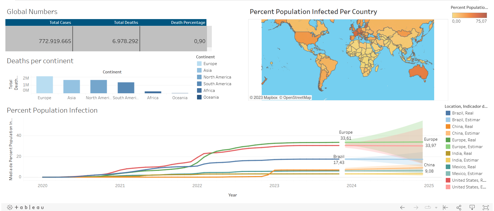

# Portfólio de Data & Analytics
Este portfólio apresenta três projetos desenvolvidos para análise de dados, contribuindo para a composição do meu portfólio profissional.

Os projetos foram inspirados e seguem as orientações de Alex the Analyst, cujos tutoriais estão disponíveis no YouTube por meio do seguinte [link](https://www.youtube.com/watch?v=qfyynHBFOsM&list=PLUaB-1hjhk8H48Pj32z4GZgGWyylqv85f&index=1)

**Projeto 1:** Análise de Dados do COVID-19
O primeiro projeto concentra-se na exploração de dados relacionados ao COVID-19, abrangendo o período de 17/03/2020 a 24/12/2023. Os detalhes e a consulta SQL podem ser encontrados neste arquivo [SQLCovid](SQLCovid.sql)

#### Processo:
- Coleta e Exploração de Dados: Realizou-se a extração e manipulação dos dados do COVID-19 utilizando SQL para análise posterior.
- Análise de Dados: Explorou-se as tendências, padrões e insights relevantes presentes nos dados obtidos.
- Visualização dos Dados: Criou-se um painel interativo no Tableau para oferecer uma representação visual clara e intuitiva das descobertas. O painel está disponível aqui.

O painel no Tableau apresenta diversas métricas, gráficos e informações dinâmicas que proporcionam uma compreensão mais profunda dos dados do COVID-19, permitindo uma análise mais abrangente das tendências e variações ao longo do tempo.[Painel](https://public.tableau.com/app/profile/eduardo.miamoto/viz/CovidDashboard_17036074077940/Painel1?publish=yes)

**Projeto 2:** Limpeza e Preparação de Dados do NashvileHousing

O segundo projeto concentrou-se na limpeza e preparação dos dados provenientes do conjunto de dados "NashvileHousing". Este conjunto está disponível para acesso [aqui](data/Nashville%20Housing%20Data%20for%20Data%20Cleaning.xlsx). Para executar a limpeza, utilizei o SQL Server Management Studio e desenvolvi o código SQL, acessível por meio deste arquivo [SQLNashville](SQLNashvile.sql).

#### Processo de Limpeza:
- Normalização do Endereço: Dividi o campo de endereço em três colunas distintas: Rua, Cidade e Estado. Isso foi realizado utilizando técnicas como SUBSTRING, CHARINDEX e posteriormente o PARSENAME, garantindo a separação adequada dos elementos do endereço para facilitar a análise futura.

- Padronização de Dados: Para garantir uniformidade e consistência, substituí "Y" por "YES" e "N" por "NÃO" em determinadas colunas, tornando todos os dados mais legíveis e compreensíveis.

- Remoção de Duplicatas: Identifiquei e removi entradas duplicadas, mantendo assim a integridade e a precisão dos dados, evitando redundâncias que poderiam distorcer análises futuras.

- Eliminação de Colunas Não Utilizadas: Analisei e removi colunas que não continham informações relevantes ou que não seriam utilizadas nos objetivos propostos, mantendo o conjunto de dados mais enxuto e focado nos aspectos essenciais para análise.

Através dessas etapas de limpeza e preparação dos dados, o conjunto de dados do NashvileHousing foi refinado, padronizado e organizado de maneira que se tornasse mais amigável e pronto para ser utilizado em análises mais aprofundadas.
